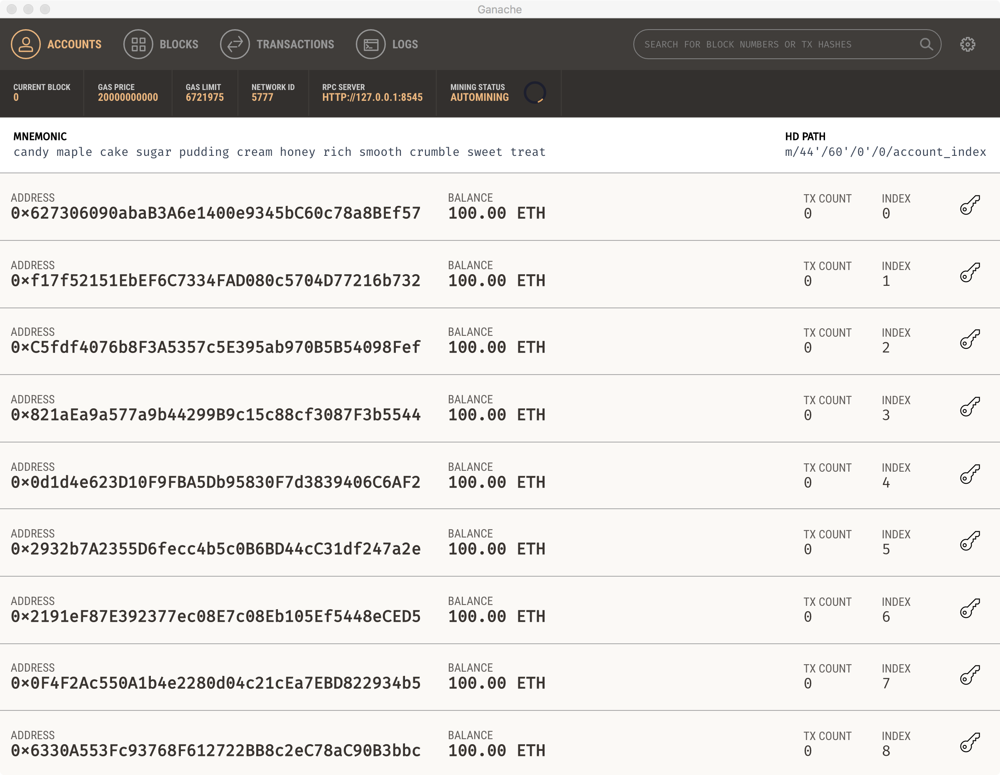

</img>

# Verinews

Verinews will utilize the power of the Ethereum blockchain to create an infrastructure that is difficult to infiltrate or corrupt. Since Verinews is not centralized, it will not suffer from having a single point of failure. The platform’s core purpose is to present news as accurately as possible, free of any corrupt incentives or hidden agendas, which plague many news corporations. Verinews attempts to address these issues by exploiting blockchain technologies and machine learning algorithms to increase accountability, credibility, and non-repudiability of online news information.

## Prerequisites

- <a href="https://github.com/trufflesuite/ganache">Ganache</a>
- <a href="https://ionicframework.com/">Ionic Framework v2</a>
- <a href="https://www.npmjs.com/">npm</a>
- <a href="https://nodejs.org/en/">Node.js</a>
- <a href="https://ipfs.io/">IPFS</a>

## Setup
Install the dependencies in the root directory:

```
npm install
```

In the terminal run the following:

```
ipfs config --json API.HTTPHeaders.Access-Control-Allow-Origin '["*"]'
ipfs config --json API.HTTPHeaders.Access-Control-Allow-Methods '["PUT", "GET", "POST"]'
ipfs daemon
```

Starts the ethereum local test network via the Ganache client:



Deploy the news manager smart contract to your local network by running the following command in the root: ```node deploycontracts.js ``` and fill the values that match the prompt questions. Below is example of the deployment from the console:

```
prompt: contractPath:  News.sol
prompt: contractName:  NewsManager
prompt: web3URI:  HTTP://127.0.0.1:8545
prompt: publicKey:  0x901473eE8ac77F0967aD3D0Ac2943d4f27668a7f
prompt: privateKey:  *******
solc: Compiling -> News.sol
{ transactionHash: '0xa1622f1f198af2fd5a0525abb7cc6f1343e2ab6a331f0016cab0f1a839c3fddd',
  transactionIndex: 0,
  blockHash: '0xd55819837c9762cf790896acef0524558b304f31637e68366ed069a9b197e300',
  blockNumber: 1,
  gasUsed: 997078,
  cumulativeGasUsed: 997078,
  contractAddress: '0x0B25cDb672E214aCB36b153F2625DF92236aB349',
  logs: [],
  status: true,
  logsBloom: '0x00000000000000000000000000000000000000000000000000000000000000000000000000000000000000000000000000000000000000000000000000000000000000000000000000000000000000000000000000000000000000000000000000000000000000000000000000000000000000000000000000000000000000000000000000000000000000000000000000000000000000000000000000000000000000000000000000000000000000000000000000000000000000000000000000000000000000000000000000000000000000000000000000000000000000000000000000000000000000000000000000000000000000000000000000000000' }
``` 

Next you have to let the webapp know where the contract is located. Open ```src/pages/home/home.ts``` within webapp and change the variable of "newManager" to the "contractAddress" from the deployment above. Lastly, launch the ionic application:

```
cd webapp
ionic serve
```


